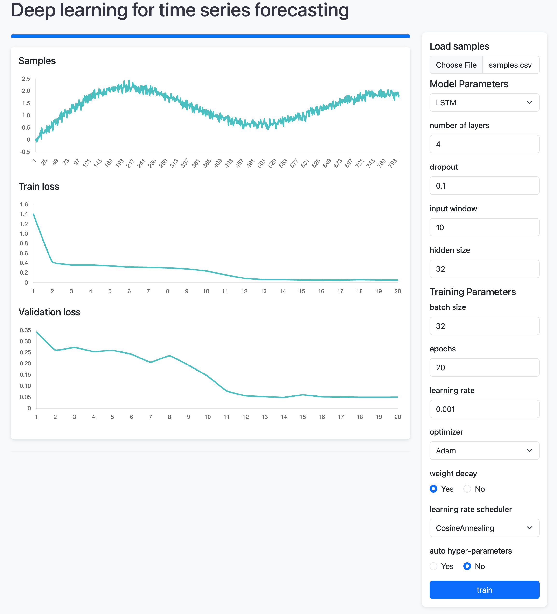

# A simple tool for time series forecasting using deep learning model
This is a simple tool for time series forecasting using deep learning model. It is written in Python and uses the pytorch library. The tool can be used for univariate time sereis data now.

The data format should be as follows: two columns in a csv file, the first column is the training data, the second column is the validation data.

- Docker is required sice it trains the model in a docker container.
- It does not support GPU training yet.
- There is no data validation now, any invalid input may cause errors.


## 🚀 Quickstart

Make sure you have [Docker](https://docs.docker.com/get-docker/) installed.
This project uses **PEP 621** metadata — all dependencies live in `pyproject.toml` (no `requirements.txt`).

```bash
# Python 3.10+ recommended
python -m venv .venv
source .venv/bin/activate   # (Windows: .venv\Scripts\activate)

# Install the package and its deps from pyproject.toml
pip install -U pip
pip install -e .

# (Optional) if you defined extras in pyproject (e.g., "dev")
# pip install -e ".[dev]"
```

> 💡 Prefer ultra-fast installs? Use **uv**:
>
> ```bash
> curl -LsSf https://astral.sh/uv/install.sh | sh
> uv venv
> source .venv/bin/activate
> uv pip install -e .
> ```


 You can run it with the following command:
``` bash
uvicorn main:app
```
Visit http://127.0.0.1:8000/ . You will see the ui in your browser.
---
